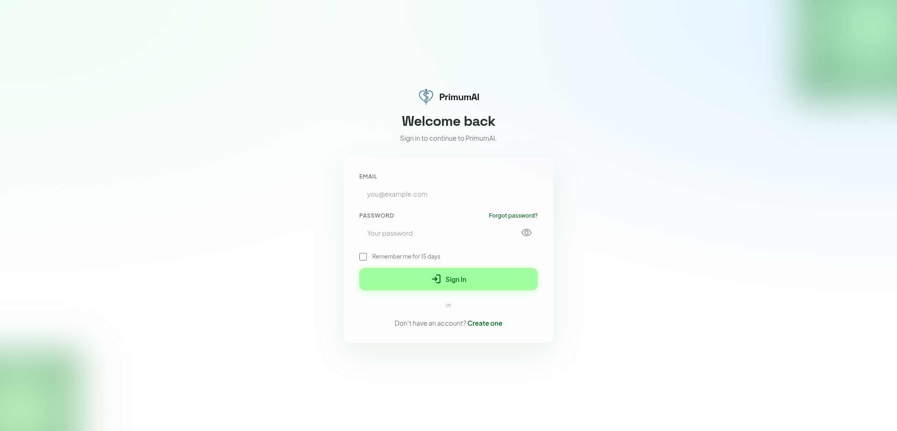
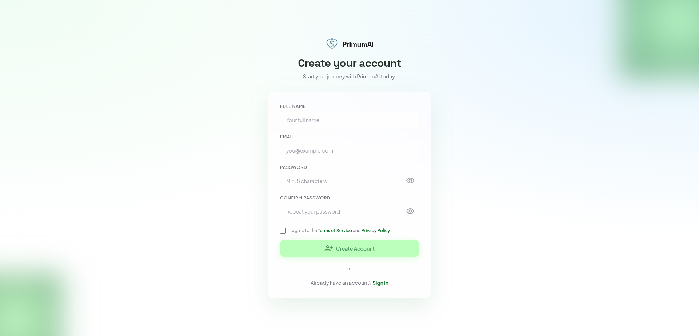
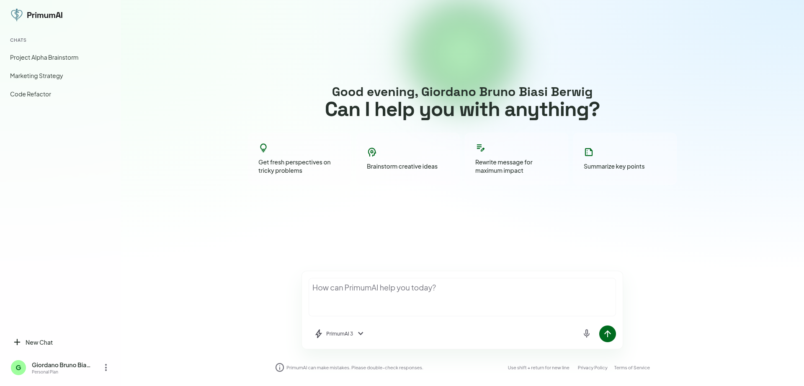

# PrimumAI Frontend 🚀

PrimumAI frontend is a React + TypeScript + Vite application integrated with a Laravel backend for authentication.

The project includes:

- 🔐 Login and Register flows connected to Laravel endpoints.
- 🕒 Session-based authentication persistence with expiration rules.
- 🛡️ Route protection based on authentication state.
- 👤 Account menu with logout behavior.
- 🧩 Typed API client, typed contracts, and reusable hooks/services architecture.

## UI Preview 🖼️

### Login Page 🔑



### Register Page 📝



### Chat Page 💬



## Tech Stack ⚙️

- React 19
- TypeScript
- Vite 8
- React Router
- Tailwind CSS 4
- ESLint 9

## Scripts 🧪

- `npm run dev`: start local development server.
- `npm run build`: run TypeScript build and production bundle.
- `npm run lint`: run linting.
- `npm run preview`: preview production build locally.

## Environment Variables 🌍

Use `.env` for local values and `.env.example` as a shared template.

Only variables prefixed with `VITE_` are exposed to the frontend at build/runtime.

- `VITE_API_BASE_URL`: Laravel host base URL, for example `http://localhost:8000`.
- `VITE_API_PREFIX`: API prefix, for example `/api`.
- `VITE_API_KEY`: value sent through `x-api-key` header.
- `VITE_API_TIMEOUT_MS`: request timeout in milliseconds. `0` disables timeout.
- `VITE_APP_ENV`: frontend environment label (`local`, `staging`, `production`).

## Authentication Integration Overview 🔗

The frontend integrates with Laravel authentication endpoints:

- `POST /login`
- `POST /register`

Requests are sent with:

- `Accept: application/json`
- `x-api-key: <VITE_API_KEY>`
- `Authorization: Bearer <token>` when session exists

All requests are centralized in the API client to keep behavior consistent.

## API Client Design 📡

Main file: `src/services/api/client.ts`

Responsibilities:

- Build backend URL from base URL + prefix + endpoint.
- Serialize body only when present.
- Add content type only when body exists.
- Parse JSON responses safely.
- Throw typed `ApiError` on non-2xx responses.
- Support timeout with `AbortController`.
- Inject auth header from session when available.

## Types Architecture 🧱

Main files:

- `src/types/api.ts`
- `src/types/auth.ts`
- `src/types/index.ts`

What is typed:

- Generic success response contract (`ApiSuccessResponse<T>`).
- Error payload shape (`ApiErrorPayload`).
- Login request and response payloads.
- Register request and response payloads.
- User and auth session models.
- Stored session model with expiration timestamp.

## Services Architecture 🛠️

Main files:

- `src/services/api/client.ts`
- `src/services/api/index.ts`
- `src/services/auth/authApi.ts`
- `src/services/auth/session.ts`
- `src/services/auth/index.ts`

### `authApi` service 🔐

Contains backend auth operations:

- `loginRequest(payload)`
- `registerRequest(payload)`

### Session service 🗂️

Contains all auth session operations:

- `saveAuthSession(auth, rememberMe)`
- `getAuthSession()`
- `clearAuthSession()`
- `isAuthenticated()`

Session data is stored in `sessionStorage` with explicit expiration (`expiresAt`).

TTL rules:

- Remember me checked: 15 days.
- Remember me unchecked: 3 hours.

Legacy cleanup is included for older values that may exist in `localStorage`.

## Hooks Architecture 🪝

Main files:

- `src/hooks/useAsyncAction.ts`
- `src/hooks/useLogin.ts`
- `src/hooks/useRegister.ts`
- `src/hooks/index.ts`

### `useAsyncAction` ⚡

Shared async state manager for hooks:

- Standardized loading and error handling.
- Protects against stale request updates.
- Prevents unsafe state updates after unmount.

### `useLogin` ✅

Flow:

1. Calls `loginRequest`.
2. Maps response to internal session shape.
3. Persists session with TTL based on remember me.
4. Exposes `login`, `isLoading`, `error`.

### `useRegister` 🆕

Flow:

1. Calls `registerRequest`.
2. Exposes `register`, `isLoading`, `error`.

## Routing and Access Control 🧭

Main file: `src/App.tsx`

Rules implemented:

- `/` is protected and renders chat only for authenticated users.
- `/login` and `/register` are public-only routes.
- Authenticated users trying to access login/register are redirected to `/`.
- Legacy `/chat` route redirects to `/`.
- Unknown routes fallback to `/`.

## Login Page Behavior 🔓

Main file: `src/screens/LoginPage/index.tsx`

Implemented behavior:

- Controlled email/password inputs.
- Remember me checkbox restored.
- Calls `useLogin` on submit.
- Displays request errors in UI.
- Redirects to `/` after successful login.

## Register Page Behavior 🧾

Main file: `src/screens/RegisterPage/index.tsx`

Implemented behavior:

- Controlled full name, email, password, and confirmation fields.
- Sends payload with `password_confirmation`.
- Validates password confirmation before request.
- Requires acceptance of terms/privacy before submission.
- Disables submit button until terms are accepted.
- Displays validation and backend errors.
- Redirects to `/login` after successful registration.

## Terms Acceptance Requirement 📜

Main file: `src/components/AuthLegalAgreement/index.tsx`

The legal agreement component is controlled and enforces explicit user consent.

Create Account is blocked unless the user accepts:

- Terms of Service
- Privacy Policy

## Chat Page Account Menu and Logout 👋

Main files:

- `src/screens/ChatPage/index.tsx`
- `src/components/Sidebar/index.tsx`

Implemented behavior:

- Account menu on the three-dot button.
- Menu entries:
  - Settings (placeholder action)
  - Logout
- Logout clears auth session and redirects to `/login`.
- Sidebar and greeting use real authenticated user name from session.

## Current Project Structure (Relevant to Auth) 🗃️

```text
src/
  hooks/
    index.ts
    useAsyncAction.ts
    useLogin.ts
    useRegister.ts
  services/
    api/
      client.ts
      index.ts
    auth/
      authApi.ts
      session.ts
      index.ts
  types/
    api.ts
    auth.ts
    index.ts
  screens/
    LoginPage/
    RegisterPage/
    ChatPage/
  components/
    Auth*/
    Sidebar/
```

## Authentication Contracts Used 📘

### Login request 📥

```json
{
  "email": "user@example.com",
  "password": "12345678"
}
```

### Login success response 📤

```json
{
  "status": "success",
  "message": "Login successful",
  "data": {
    "access_token": "...",
    "token_type": "Bearer",
    "user": {
      "id": 1,
      "name": "User Name",
      "email": "user@example.com",
      "email_verified_at": null,
      "created_at": "...",
      "updated_at": "..."
    }
  }
}
```

### Register request 📥

```json
{
  "name": "User Name",
  "email": "user@example.com",
  "password": "12345678",
  "password_confirmation": "12345678"
}
```

### Register success response 📤

```json
{
  "status": "success",
  "message": "User registered successfully",
  "data": {
    "user": {
      "id": 1,
      "name": "User Name",
      "email": "user@example.com",
      "created_at": "...",
      "updated_at": "..."
    }
  }
}
```

## Setup Instructions 🧰

1. Install dependencies:

```bash
npm install
```

2. Configure environment:

```bash
cp .env.example .env
```

3. Update `.env` with your backend values.

4. Start development server:

```bash
npm run dev
```

5. Build for production:

```bash
npm run build
```

## Notes 📝

- This project currently uses `sessionStorage` for auth persistence plus TTL checks.
- `x-api-key` is sent from frontend as configured in environment variables.
- Settings menu action is intentionally a placeholder until a settings page is implemented.
